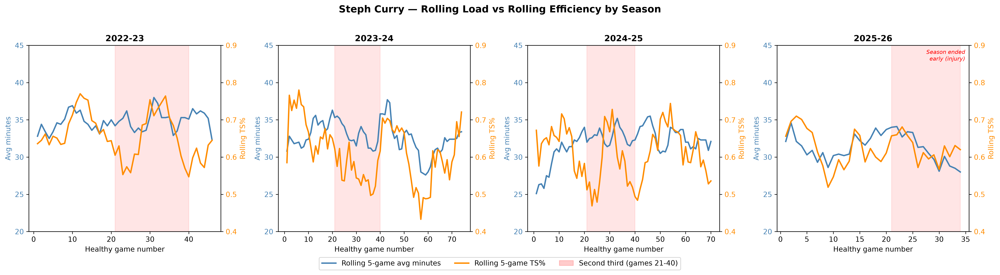
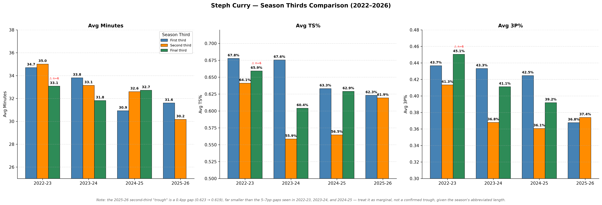
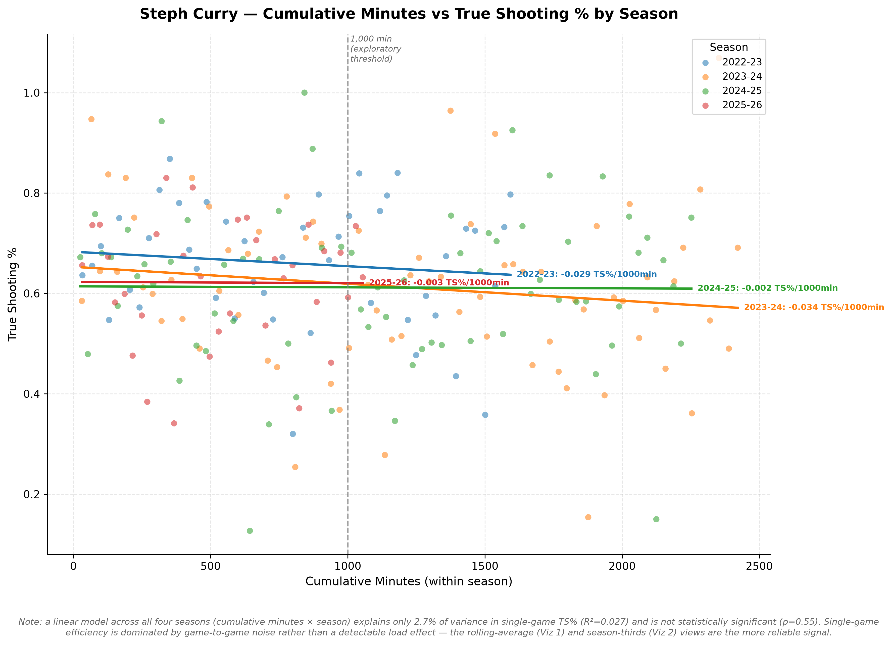

# Cumulative Load and Scoring Efficiency in Steph Curry: A Four-Season Analysis (2022–2026)

A BigQuery + Python + Tableau analysis of whether cumulative in-season workload predicts scoring efficiency decline in Steph Curry, and whether that fatigue threshold shifts earlier as he ages.

**[View the interactive Tableau dashboard →](https://public.tableau.com/app/profile/rohan.varkey/viz/CumulativeLoadandScoringEfficiencyinStephCurryAFour-SeasonAnalysis20222026/Dashboard1)**

---

## Research Question

Does cumulative minutes load predict scoring efficiency decline in Steph Curry, and does the threshold at which fatigue becomes visible shift earlier in the season as he ages?

Load management is one of the most important and contested topics in modern NBA operations. Teams spend millions managing player minutes to prevent injury and preserve playoff performance. This project uses four seasons of game-level data (2022–23 through 2025–26) to quantify whether there's a measurable relationship between cumulative load and output decline — and whether that relationship changes as a player ages into his late 30s.

## Data

- **Source:** Basketball-Reference.com — regular season game logs only, four seasons, 224 healthy game appearances after injury/load-management filtering
- **Storage:** Google BigQuery, six-view dependency chain from raw game logs to final analytical layer
- **Injury flagging:** Dynamic 8-CTE consecutive-game detection distinguishing genuine injury absences from scheduled rest, with a validated bug fix applied mid-project (see `sql/05_curry_with_flags.sql` for details)

## Key Findings

1. **Warriors' load management is exceptionally precise.** ACWR (acute:chronic workload ratio) never exceeded 1.3 across 224 healthy games — average ≈1.0 in every season, evidence of tightly controlled single-game load spikes.
2. **A consistent mid-season efficiency trough exists in 3 of 4 seasons.** The second third of each season (games 21–40) shows the weakest True Shooting % in 2022-23, 2023-24, and 2024-25. 2025-26's injury-shortened season shows only a marginal gap, not a confirmed trough.
3. **An aging signal is visible independent of in-season load.** First-third TS% has declined every season (0.678 → 0.676 → 0.633 → 0.623), present before load accumulates within a season.
4. **Three-point efficiency has declined steadily.** From 0.428 in 2022-23 to 0.370 in 2025-26 — a 5.8 percentage-point drop, though the data can't isolate fatigue from aging, defensive scheme evolution, or league-wide adaptation.
5. **Single-game data is too noisy for a raw linear relationship to hold.** A combined linear regression of TS% on cumulative minutes × season explains just 2.7% of variance (R²=0.027) and isn't statistically significant (p=0.55) — which is exactly why the rolling-average and season-thirds views, not raw per-game trends, are this project's primary evidence.

Full findings, methodology, and limitations are documented in [`docs/Portfolio_Project_1_Documentation_V9.docx`](docs/Portfolio_Project_1_Documentation_V9.docx).

## Visualizations

**Rolling 5-game load vs. efficiency, by season**

**Season-thirds comparison — minutes, TS%, and 3P%**

**Cumulative minutes vs. TS%, with per-season trend lines**

The full interactive version of all three, plus dashboard-wide season filtering, is available on the **[published Tableau dashboard](https://public.tableau.com/app/profile/rohan.varkey/viz/CumulativeLoadandScoringEfficiencyinStephCurryAFour-SeasonAnalysis20222026/Dashboard1)**.

## Methodology

**BigQuery view chain** (`sql/`), applied in order:
1. `curry_all_seasons` — UNION ALL of four seasons' raw game logs
2. `curry_with_game_numbers` — sequential game numbering per season
3. `curry_with_minutes` — MM:SS minutes converted to decimal
4. `curry_active_only` — filtered to games actually played
5. `curry_with_flags` — 8-CTE dynamic injury/load-management/return-period flagging
6. `curry_load_analysis` — final layer: rolling load metrics, ACWR, efficiency metrics, load buckets, season thirds, fatigue flag

**Python visualizations** (`python/`): three matplotlib scripts building on the final BigQuery view, each exported at 300 DPI.

**Tableau dashboard**: five interactive sheets (rolling load, three season-thirds panels, cumulative-minutes scatter) combined into one dashboard-wide filterable view.

## Limitations

- ACWR window sizes (5/10 games) are proxies for the sports-science standard 7-day/28-day windows, constrained by game-log data granularity
- Cumulative-minute load buckets (1,000/1,500/2,000) are exploratory segmentation points, not clinically validated fatigue boundaries
- Several sub-groups have small sample sizes (flagged explicitly throughout) and are interpreted cautiously
- Single-player analysis — findings are specific to Curry and not generalizable without replication
- Healthy-worker survivor effect: players are typically managed out on their highest-load days, meaning observed game-log data likely underestimates true physiological load

Full limitations list in the documentation.

## Future Work

The descriptive approach here (rolling averages, load buckets, season thirds) surfaces a consistent pattern but can't formally test for a fatigue threshold or isolate season-specific effects from career-wide trends. A natural extension: piecewise regression and mixed-effects modeling (random intercepts/slopes by season) on an enriched dataset including days-rest and opponent defensive rating — scoped but deliberately left for a future iteration to prioritize a complete, shippable analysis first.

## Tech Stack

- **Data warehouse:** Google BigQuery
- **Querying:** SQL (window functions, CTEs, dynamic flagging logic)
- **Analysis/visualization:** Python (pandas, matplotlib, numpy)
- **Dashboard:** Tableau Public
- **Environment:** Jupyter Notebook, Miniconda

## Author

Rohan Varkey — Strength & Conditioning Specialist transitioning into sports data analytics.
